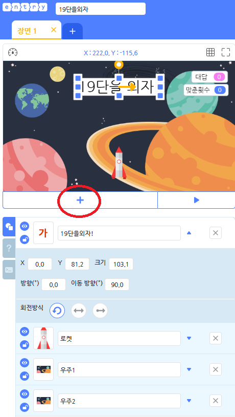
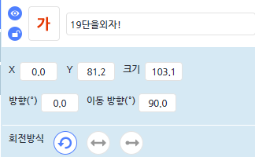
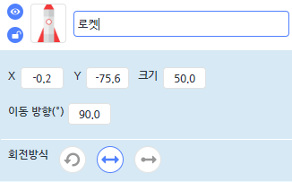
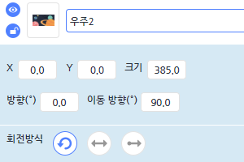

# 19단외우기 게임 만들기

### 코드 설명



<br>
먼저 동그라미친 플러스 부분에서 우주배경 2개와 로켓 글상자 하나를 가져옵니다.
<br>

<br>



<br>

글상자오브젝트를 추가한후 코드를 작성하고 오브젝트의 좌표를 사진에 맞게 조정합니다.

```buildoutcfg
import Entry
왼쪽숫자 = 0
오른쪽 숫자 = 0
정답 = 0
맞춘횟수 = 0
```
import Entry 는 파이썬 모듈중에서 엔트리 모듈을 불러온다는 코드입니다.
엔트리에서 사용해야하므로 이코드는 반드시 필요합니다. 그리고 왼쪽숫자,오른쪽숫자,정답,맞춘횟수는
파이썬에서 선언해주는 전역변수입니다. 모든 코드에 작성될 예정입니다. 그리고 왼쪽 숫자와 오른쪽숫자 정답이
따로 나와있는 이유는 ((왼쪽 숫자 X 오른쪽 숫자 = 정답)) 순으로 시간적인 텀을 주기위함입니다.

<br>

```buildoutcfg
def when_start():
    while True:
        if 맞춘횟수 == 10:
            Entry.write_text("성공! 클리어하였습니다.")
            Entry.stop_code("all")
```

<br>

def when_start()는 시작을 뜻하는 지정되어있는 함수입니다.
맞춘횟수가 10이 되면 성공 클리어라는 문구가 뜨게하고 모든 코드를 종료합니다.

```buildoutcfg
        Entry.wait_for_sec("0.1")
        Entry.write_text(왼쪽숫자)
        Entry.wait_for_sec("0.2")
        Entry.append_text("X")
        Entry.wait_for_sec("0.2")
        Entry.append_text(오른쪽숫자)
        Entry.wait_for_sec("0.2")
        Entry.append_text("=")
        Entry.wait_until(정답 == Entry.answer())
        if 정답 == Entry.answer():
            Entry.append_text(정답)
            Entry.wait_for_sec("1")
``` 

<br>

코드실행 후 0.1초후에 왼쪽숫자가 등장하고 각각 0.2초후에 곱하기, 오른쪽숫자, =,이 등장하게됩니다
코드실행 후 0.1초의 텀을 주는 이유는 변수가 바뀔수있는 시간적여유를 주기위함입니다.
그리고 만약에 내가 적은 답이 정답이라면 1초 동안 "=" 뒤에 정답을 보여주게됩니다.

<br>



<br>

로켓 오브젝트를 사진과같은 좌표와 크기로 조정합니다.

```buildoutcfg
import Entry
왼쪽숫자 = 0
오른쪽 숫자 = 0
정답 = 0
맞춘횟수 = 0
```

다음코드는 글상자 오브젝트를 작성하게 되면 자동으로 따라오게 되니 우주오브젝트에서는 작성하지않겠습니다.

<br>

```buildoutcfg
def when_start():
    Entry.answer_view("hide")
    왼쪽숫자 = random.randint("1", "19")
    오른쪽숫자 = random.randint("1", "19")
    정답 = 왼쪽숫자 * 오른쪽숫자
```
<br>

def when_start()는 시작을 뜻하는 지정되어있는 함수입니다.
그리고 왼쪽 숫자라는 변수와 오른쪽숫자라는 변수 에서 1~19사이의 숫자를 임의로 설정합니다.
정답에는 왼쪽숫자 곱하기 오른쪽숫자를 저장합니다.

<br>

```buildoutcfg
    while True:
        Entry.input("정답은?")
        if 정답 == Entry.answer():
            맞춘횟수 += 1
            왼쪽숫자 = random.randint("1", "19")
            오른쪽숫자 = random.randint("1", "19")
            정답 = 왼쪽숫자 * 오른쪽숫자
            Entry.send_signal("정답")
            Entry.change_shape("로켓_2")
            Entry.wait_for_sec("0.2")
            Entry.change_shape("로켓_3")
            Entry.wait_for_sec("0.2")
            Entry.change_shape("로켓_4")
            Entry.print_for_sec("정답입니다.", "1")
        else:
            Entry.print_for_sec("오답입니다.", "1")
```

정답을 물어보는 input을 생성하여 대답을 듣고 만약에 정답이라면
로켓의 모양을 지정된 오브젝트로 설정하면서 움직이는 효과를 나타내줍니다.
그리고 정답일 시에는 맞춘횟수를 1증가시키고 
Entry.print_for_sec("정답","1") #정답입니다라는 글을 1초 보여줍니다.
Entry.print_for_sec("오답","1") #오답입니다라는 글을 1초 보여줍니다.

그리고 Entry.send_signal("정답")으로 정답이라는 신호를 보내줍니다.
이 코드는 우주배경을 움직이는 데 사용될 것입니다.

<br>


<br>

우주 1의 오브젝트를 사진에 나오는 좌표와 크기로 수정해줍니다. (수정시에 배경잠금자물쇠를 한번더 클릭해주세요)

```buildoutcfg
def when_get_signal("정답"):
    Entry.add_xy_for_sec("0", "-30", "2")
    if Entry.value_of_object("self", "y") <= "-270":
        Entry.set_y("270")
```

아까전 로켓에서 정답신호를 보내면 배경이 2초동안 -30만큼 움직이게 되고 y가 -270이 넘는다면
배경을 y=270으로 이동시킵니다.

<br>



<br>

우주 2의 오브젝트를 사진에 나오는 좌표와 크기로 수정해줍니다. (수정시에 배경잠금자물쇠를 한번더 클릭해주세요)

```buildoutcfg
def when_start():
    Entry.set_y("270")

def when_get_signal("정답"):
    Entry.add_xy_for_sec("0", "-30", "2")
    if Entry.value_of_object("self", "y") <= "-270":
        Entry.set_y("270")
```

<br>

코드가 시작된다면 배경을 y = 270으로 보내고 시작하면서 정답시 2초동안 y를 -30으로 이동합니다.
코드시작시 배경을 y =270으로 이동시키는 이유는 배경을 움직이는 시각적 효과를 주기 위함입니다.

자 간단한 코드로 19단을 외우는 엔트리 게임을 만들어보았습니다. 다들 실습을 통해 파이썬과 엔트리 둘다 익혀 봅시다!

