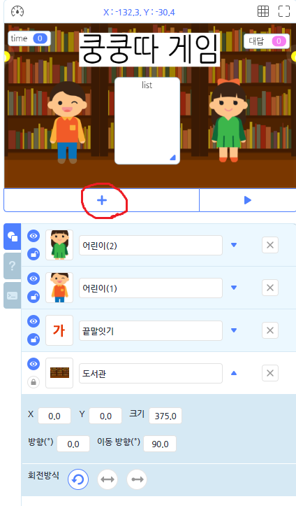
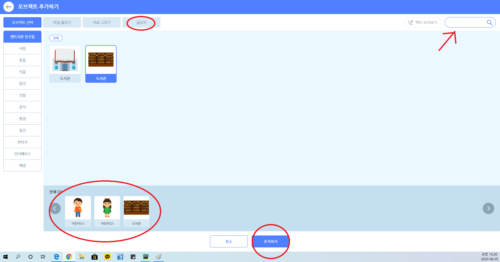
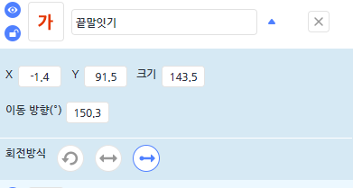
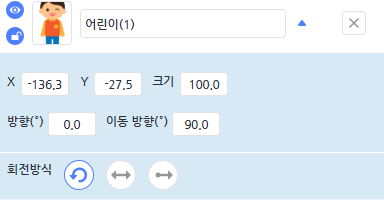
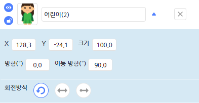

# 쿵쿵따 게임!

### 쿵쿵따리 쿵쿵따! 3글자 단어로 중복없이 승부를 내자!

## 코드설명



<br>

 + 오늘 할 게임에서는 다음과 같은 오브젝트들이 필요합니다 먼저 빨간 동그라미가 쳐져있는 플러스를 클릭합니다.

<br>



<br>

1. 화살표에 어린이를 검색하고 2명의 어린이 오브젝트를 검색합니다.
2. 도서관배경을 검색하여 추가합니다
3. 다시 오브젝트 추가를 클릭하여 글상자를 클릭하여 끝말잇기라고 적은후 추가하기를 클릭합니다.

```buildoutcfg
#공통변수(전역변수)
word = 0
time = 0 
game_over = 0
wordlist = []
time =[]
```
<br>

 + 제가 입력할 단어를 받아올 변수 word와 시간을 재줄 time변수를 설정합니다
 그리고 제가 적은 단어들을 담을 wordlist를 만들어줍니다.
  
<br>



<br>

 + 글상자 오브젝트의 좌표와 크기를 사진과 같이 지정해줍니다.
 
 ```buildoutcfg
def when_start():
    Entry.input("처음시작할 단어를 정해주세요!")
    word = Entry.answer()
    Entry.send_signal("남자")
```

<br>

 + 다음 코드를 해석해보면 프로그램이 시작되면 처음에 입력받은 대답으로 단어변수에 저장하고
 남자쪽아이에게 신호를 보내어 게임을 실행 하게 됩니다.
 
 
 <br>
 
 
 
 <br>
 
  + 사진에 보이는 어린이의 좌표와 크기를 설정해줍니다
  
 ```buildoutcfg
def when_get_signal("남자"):
    while True:
        Entry.hide_variable(None)
        time += 1
        Entry.wait_for_sec(1)
        if time >= "10":
            game_over = 1
            if game_over == 1:
                Entry.hide_variable("time")
                Entry.answer_view("hide")
                Entry.print_for_sec("아쉽게 패배!", "2")
                Entry.print_for_sec("여자아이의 승리!", "2")
                Entry.stop_code("all")

```

 + 글상자에서 남자라는 신호를 받았을때 실행됩니다. Entry.hide_variable(game_over)는 화면상에 뜨는 게임오버 변수를 보이지 않게 하겠다는 의미입니다.
 그리고 while True 문을 사용하여 시간이 계속 가는것을 해석할 수있습니다.
 만약에 time이 10을 초과하게되면 게임오버 변수가 1이 되면서 여자아이의 승리를 말해주고
 모든코드는 종료하게됩니다.
 
 <br>
 
 ```buildoutcfg
ef when_get_signal("남자"):
    while True:
        Entry.input((word[len(word) - 1] + "으로 시작되는말 :"))
        if Entry.answer()[0] == word[len(word) - 1] and len(Entry.answer()) == 3 /n
                                                    and not (Entry.answer() in wordlist):
            word = Entry.answer()
            wordlist.append(word)
            time = 0
            Entry.stop_code("others")
            Entry.send_signal_wait("여자")
        else:
            Entry.print_for_sec("다른단어를 작성해주세요", "2")
``` 

 + 남자라는 신호를 받았을때 마찬가지로 실행이됩니다. 그리고 word[len(word)-1]이라는 코드는
 남자아이가 적은 글자의 가장 마지막자리 index를 불러와서 끝말잇기를 진행하고 1. 불러온 index와 여자아이의 첫글자
 일치 하지않고 2. 글자수가 3글자가 아니고 3. 미리 나온단어라면 순서는 넘어 가지않는다 라는
 코드입니다. 그리고 성공적인 대답이 이루어지면 시간을 0으로 정해줍니다.
 
  + Entry.stop_code("others")는 대답이 이루어졋을때 나의 다른 코드가 실행되는 것을 방지하기위한
 코드입니다. 그후 여자아이에게 신호를 보내게 되고 위 조건을 만족하지 못할시에는
 다른 단어를 입력해달라는 문구를 뜨도록만듭니다.
 
 <br>
 
 
 
 <br>
 
  + 여자아이 오브젝트의 좌표와 크기를 다음과 같이 설정합니다.
  
  <br>

```buildoutcfg
def when_get_signal("여자"):
    while True:
        Entry.hide_variable("game_over")
        time += 1
        Entry.wait_for_sec(1)
        if time >= "10":
            game_over = 1
            if game_over == 1:
                Entry.answer_view("hide")
                Entry.hide_variable("time")
                Entry.print_for_sec("아쉽게 패배!", "2")
                Entry.print_for_sec("남자아이의 승리!", "2")
                Entry.stop_code("all")

def when_get_signal("여자"):
    while True:
        Entry.input((word[len(word) - 1] + "으로 시작되는말 :"))
        if Entry.answer()[0] == word[len(word) - 1] and len(Entry.answer()) == 3 and not (Entry.answer() in wordlist):
            word = Entry.answer()
            wordlist.append(word)
            time = 0
            Entry.stop_code("others")
            Entry.send_signal_wait("남자")
        else:
            Entry.print_for_sec("다른단어를 작성해주세요", "2")
```
 
  + 코드는 남자아이코드와 같고 신호보내는 것과 남자아이승리 라는 글정도만바꾸어줍니다.
  
  
  ### 게임을 완성하고 직접 게임 해보고 단어왕이 되시길 바라겠습니다!
  