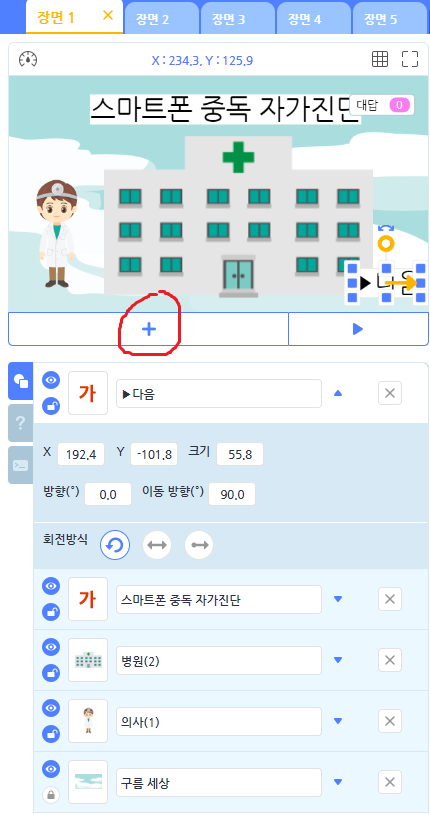
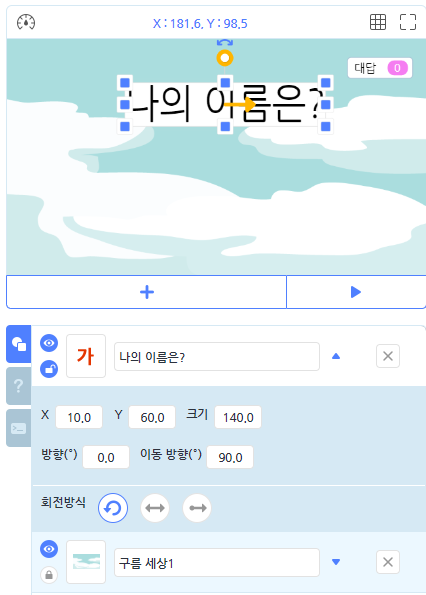
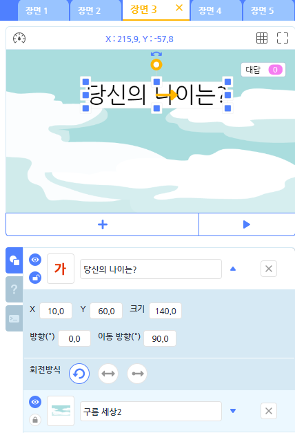
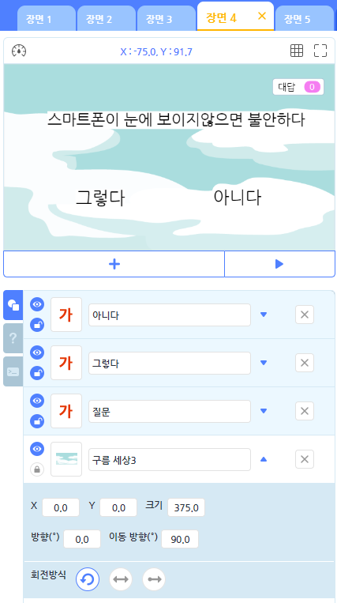
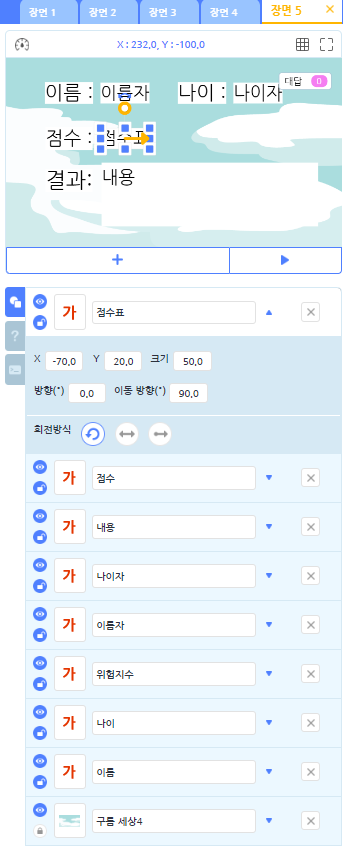

# 스마트폰 중독진단(스스로 평가)

### 스스로 평가 해보는 스마트폰 중독진단

 + 오늘 프로젝트의 주된 목적
 1. 장면을 여러개 사용하여 장면을 넘길수 있다
 2. 오브젝트 클릭사용 익히기
 3. 신호를 통한 글상자내용 변경하기
 4. 프로젝트를 따라해보고 스스로 다른내용 평가지 만들어 보기


## 코드 설명

#### * 따로 오브젝트 코드가 없다면 아무것도 적지않아도 되는 오브젝트라는 뜻입니다.




<br>

 + 장면1의 오브젝트를 추가하기를 클릭하여 사진에 나오는 오브젝트를 추가합니다
 (오브젝트들의 위치는 임의로 설정합니다.)
 
 <br>
 
 ```buildoutcfg
#공통변수(전역변수)

name = 0
age = 0
point = 0
p_number = 0
```

 + 위변수들은 각장면마다 자동으로 포함되는 전역변수 입니다.
 
 <br>
 
 + 이제 차근차근 블럭들의 코드를 설명하겠습니다.
 
 ```buildoutcfg
#의사 오브젝트의 코드

def when_start():
    Entry.answer_view("hide")
    Entry.print_for_sec("안녕하세요", "2")
    Entry.print_for_sec("스마트폰 중독여부 테스트를 진행하겠습니다.", "2")
    Entry.print("우측하단 버튼을 눌러주세요")
```

<br>
 
 + 프로젝트가 시작되면 의사 오브젝트에서 이 평가지가 어떤 평가지인지 간략한 설명을 합니다.
 그리고 우측하단 버튼을 눌러 진행할수 있도록 유도합니다.
 
 <br>
 
 ```buildoutcfg
#▶다음 오브젝트의 코드

def when_click_object_on():
    Entry.start_scene_of("next")
```

 + 이번시간에 처음본 코드입니다. 오브젝트를 클릭하면 다음장면으로 넘기겠다는 코드입니다.
 
 
 <br>
 
 
 
 <br>
 
 ```buildoutcfg
#구름세상1 오브젝트의 코드

def when_start_scene():
    Entry.answer_view("hide")
    Entry.input("이름:")
    name = Entry.answer()
    Entry.wait_for_sec("0.5")
    Entry.start_scene_of("next")
```

 + 장면이 시작되었을때 이름을 물어봅니다. 여기서 글상자가 아니라 배경에서 묻는이유는
 배경에서 물어봐야 아래쪽에 글쓰는 창이 나오기때문입니다(미관상..ㅎ) 그리고 이름을 작성하게 되면
 다음장면으로 넘어가게됩니다.
 
 <br>
 
 
 
 <br>
 
 ```buildoutcfg
#구름세상2 오브젝트의 코드

def when_start_scene():
    Entry.answer_view("hide")
    Entry.input("나이:")
    age = Entry.answer()
    Entry.wait_for_sec("0.5")
    Entry.start_scene_of("next")
```

 + 장면2에서의 나이를 묻는 것과 동일합니다 역시 나이를 입력하면 다음으로 넘어갑니다.
 
 <br>
 
 
 
 <br>
 
```buildoutcfg
#질문 글상자 오브젝트의 코드

def when_get_signal("one"):
    Entry.write_text("일어나자마자 스마트폰을 본다")

def when_get_signal("two"):
    Entry.write_text("정보를 찾아야할 때 스마트폰부터 찾는다")

def when_get_signal("three"):
    Entry.write_text("핸드폰을 쓰고싶을때 쓰지못하면 짜증난다")

def when_get_signal("four"):
    Entry.write_text("휴대폰 배터리가 없으면 불안하고 초조하다")

def when_get_signal("five"):
    Entry.write_text("데이터를 모두 썻을 때 와이파이가 없다면 불안하다")

def when_get_signal("six"):
    Entry.write_text("스마트폰이 뜨거워질때 까지 사용한 적이 있다")

def when_get_signal("seven"):
    Entry.write_text("밤에 잠못자는 이유가 스마트폰때문인거 같다")

def when_get_signal("eight"):
    Entry.write_text("밥먹을때 수시로 휴대폰을 확인하곤 한다")

def when_get_signal("nine"):
    Entry.write_text("가족과의 대화보다 카톡을 더 많이한다.")
```

 + 길어보여서 어려워 보일수있습니다. 하지만 한줄만 정확히 해석해보면 다같은 코드의 반복이라는 것을 알수있습니다.
 처음 질문 글상자에 '스마트폰이 눈에 보이지않으면 불안하다'는 작성해주셔야합니다.
 그리고 나머지 두개의 글상자에 각각 '그렇다' 와 '아니다' 를 입력해줍니다.
 코드를 보겠습니다. def when_get_signal()이라는 것은 신호를 보내었을때 발생한다는 코드입니다
 신호를 받았을때 질문을 하게 됩니다. 본인이 원하는 질문을 하면 됩니다.
 
<br>
 
```buildoutcfg
def when_get_signal("End"):
    Entry.set_y("-5")
    Entry.write_text("결과가 발표됩니다! 잠시만기다리세요")
    Entry.wait_for_sec("3")
    Entry.start_scene_of("next")
```

 + 그리고 마지막 질문이 끝났을 때, 질문상자를 원하는 위치에 옮기고 결과발표를 기다려달라는 말을 작성합니다.

<br>

```buildoutcfg
#그렇다 글상자 오브젝트의 코드
def when_click_object_on():
    if P_number == 0:
        Entry.wait_for_sec("0.1")
        point = point + "1"
        P_number = P_number + "1"
        Entry.wait_for_sec("0.2")
        Entry.send_signal("one")

def when_click_object_on():
    if P_number == 2:
        Entry.wait_for_sec("0.1")
        point = point + "1"
        P_number = P_number + "1"
        Entry.wait_for_sec("0.2")
        Entry.send_signal("three")

def when_click_object_on():
    if P_number == 3:
        Entry.wait_for_sec("0.1")
        point = point + "1"
        P_number = P_number + "1"
        Entry.wait_for_sec("0.2")
        Entry.send_signal("four")

def when_click_object_on():
    if P_number == 5:
        Entry.wait_for_sec("0.1")
        point = point + "1"
        P_number = P_number + "1"
        Entry.wait_for_sec("0.2")
        Entry.send_signal("six")

def when_click_object_on():
    if P_number == 4:
        Entry.wait_for_sec("0.1")
        point = point + "1"
        P_number = P_number + "1"
        Entry.wait_for_sec("0.2")
        Entry.send_signal("five")

def when_click_object_on():
    if P_number == 1:
        Entry.wait_for_sec("0.1")
        point = point + "1"
        P_number = P_number + "1"
        Entry.wait_for_sec("0.2")
        Entry.send_signal("two")

def when_click_object_on():
    if P_number == 6:
        Entry.wait_for_sec("0.1")
        point = point + "1"
        P_number = P_number + "1"
        Entry.wait_for_sec("0.2")
        Entry.send_signal("seven")

def when_click_object_on():
    if P_number == 7:
        Entry.wait_for_sec("0.1")
        point = point + "1"
        P_number = P_number + "1"
        Entry.wait_for_sec("0.2")
        Entry.send_signal("eight")

def when_click_object_on():
    if P_number == 8:
        Entry.wait_for_sec("0.1")
        point = point + "1"
        P_number = P_number + "1"
        Entry.wait_for_sec("0.2")
        Entry.send_signal("nine")

def when_click_object_on():
    if P_number == 9:
        point = point + "1"
        Entry.wait_for_sec("0.2")
        Entry.send_signal("End")
```

 + 마찬가지로 코드는 길어보이지만 각신호마다 행하는 행동이 다를뿐 결국 같은 코드입니다.
 def when_click_object_on() 오브젝트를 클릭했을때 코드가 실현됨을 알수있습니다.
 
 + 만약 P_number각각의 값에따라 실현되며 point 변수를 통해 지금까지 몇점을 획득했는지 세어 줍니다. 그리고
 P_number에 1씩 더해주면서 몇번째신호를 보내야 하는지에 대해 체크해줍니다.
 
 
 ```buildoutcfg
def when_get_signal("End"):
    Entry.clear_text()
```

 + 마지막에 End 신호를 받게 되면 텍스트를 다지워줍니다. 그이유는 질문 글상자에서 결과발표할때
 옆에 보이지 않게 하려고 하는것입니다.
 
 <br>
 
```buildoutcfg
#아니다 글상자 오브젝트의 코드

def when_click_object_on():
    if P_number == 0:
        Entry.wait_for_sec("0.1")
        point = point
        P_number = (P_number + "1")
        Entry.wait_for_sec("0.2")
        Entry.send_signal("one")

def when_click_object_on():
    if P_number == 1:
        Entry.wait_for_sec("0.1")
        point = point
        P_number = (P_number + "1")
        Entry.wait_for_sec("0.2")
        Entry.send_signal("two")

def when_click_object_on():
    if P_number == 2:
        Entry.wait_for_sec("0.1")
        point = point
        P_number = (P_number + "1")
        Entry.wait_for_sec("0.2")
        Entry.send_signal("three")

def when_click_object_on():
    if P_number == 3:
        Entry.wait_for_sec("0.1")
        point = point
        P_number = (P_number + "1")
        Entry.wait_for_sec("0.2")
        Entry.send_signal("four")

def when_click_object_on():
    if P_number == 4:
        Entry.wait_for_sec("0.1")
        point = point
        P_number = (P_number + "1")
        Entry.wait_for_sec("0.2")
        Entry.send_signal("five")

def when_click_object_on():
    if P_number == 5:
        Entry.wait_for_sec("0.1")
        point = point
        P_number = (P_number + "1")
        Entry.wait_for_sec("0.2")
        Entry.send_signal("six")

def when_click_object_on():
    if P_number == 6:
        Entry.wait_for_sec("0.1")
        point = point
        P_number = (P_number + "1")
        Entry.wait_for_sec("0.2")
        Entry.send_signal("seven")

def when_click_object_on():
    if P_number == 7:
        Entry.wait_for_sec("0.1")
        point = point
        P_number = (P_number + "1")
        Entry.wait_for_sec("0.2")
        Entry.send_signal("eight")

def when_click_object_on():
    if P_number == 8:
        Entry.wait_for_sec("0.1")
        point = point
        P_number = (P_number + "1")
        Entry.wait_for_sec("0.2")
        Entry.send_signal("nine")

def when_click_object_on():
    if P_number == 9:
        point = point
        Entry.wait_for_sec("0.2")
        Entry.send_signal("End")

def when_get_signal("End"):
    Entry.clear_text()
```

 + 전반적으로 그렇다 글상자와 코드가 비슷합니다 다른점은 point를 그대로 유지한채
 신호를 준다는 것인데 이유는 그렇다는 중독여부에대한 평가가 필요하기때문에 1점씩 추가하고
 아니다는 중독에 대한 점수를 줄필요가 없기때문에 1점을 추가해 주지 않습니다.
 
 <br>
 
 
 
 <br>
 
 + 글상자는 다소 많지만 간단한 기능 글상자들을 먼저 설명하겠습니다.
 
 ```buildoutcfg
#이름자

def when_start_scene():
    Entry.write_text(name)
#나이자

def when_start_scene():
    Entry.write_text(age)
#점수표

def when_start_scene():
    Entry.write_text(point)
```

 + 각각 글상자에 입력받았 던 변수들을 표시해줍니다.
 
```buildoutcfg
# 내용 오브젝트의 코드

def when_start_scene():
    if 0 <= point and point <= 3:
        Entry.write_text(" 위험수치 낮음 ")
        Entry.wait_for_sec("0.2")
        Entry.append_text("지금만큼만 사용해주세요.")
    if 3 < point and point <= 7:
        Entry.write_text(" 위험수치 보통 ")
        Entry.wait_for_sec("0.2")
        Entry.append_text("스마트폰사용을 줄여주세요")
    if 7 < point and point <= 10:
        Entry.write_text(" 위험수치 높음 ")
        Entry.wait_for_sec("0.2")
        Entry.append_text("당장 스마트폰을 2G폰으로바꾸세요")
```
 + 0~3점사이는 위험수치낮음, 4~7점사이는 위험수치보통, 8~10점사이는 위험수치 높음으로
 평가하여 안전문구를 표시해주고 프로젝트를 종료합니다. 단 내용글상자는 글상자 속성에서 여러줄쓰기를
 사용하는것을 권장합니다.
 
 ### 따라서 만들어 보는 평가지도 좋지만! 스스로 해보고싶은 평가지를 만들어 친구들과 돌려 해봅시다!